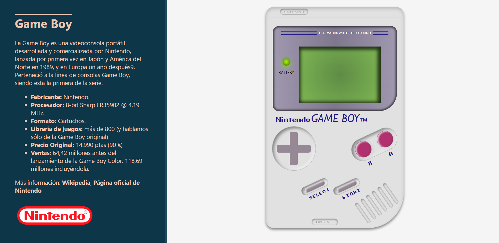

# Proyecto 1 - Videoconsola con HTML5 y CSS3
Aplicación web que emula el aspecto visual de la consola de video juegos **Nombre de la consola**. Incluye además algunas funciones que hacen posible la interacción del usuario.



URL: https://ilkogarcia.github.io/igp-btc-fsd-pry1-videoconsola/

## Table of Contents
1. [Información general](#info)
2. [Tecnologías](#tech)
3. [Instalación](#install)

## <a name="info"></a>Información general
Este proyecto puede considerare como un MVP y se encuentra aún en desarrollo. Durante el desarrollo de la aplicación hemos tenido algunos retos, como conseguir rotar los elementos o crear efectos de profundidad. Esto último no se ha conseguido hacer de modo realista y aún tiene margen para mejorar. En futuras versiones iremos mejorando el aspecto visual para que sea más próximo al producto real. También queremos agregarle algunas acciones o animación en javascript.

``Este proyecto se ha levado a cabo dentro del marco del Bootcamp FullStack Developer realizado en Valencia, entre enero y marzo de 2023.``

## <a name="tech"></a>Technologías
Las tecnologías utilizadas en el desarrollo de la aplicación son:
* [HTML5](https://developer.mozilla.org/en-US/docs/Glossary/HTML5)
* [CSS3](https://developer.mozilla.org/en-US/docs/Web/CSS)

## <a name="install"></a>Instalación
Para descargar el proyecto en tu entorno de desarrollo sigue las instrucciones siguientes:

```
$ git clone https://example.com
$ cd ../path/to/the/file
$ code .
```

Para utilizar la aplicación necesitarás desplegar la estructura de carpetas y archivos del proyecto en un servidor web instalado en local o en un servidor. 